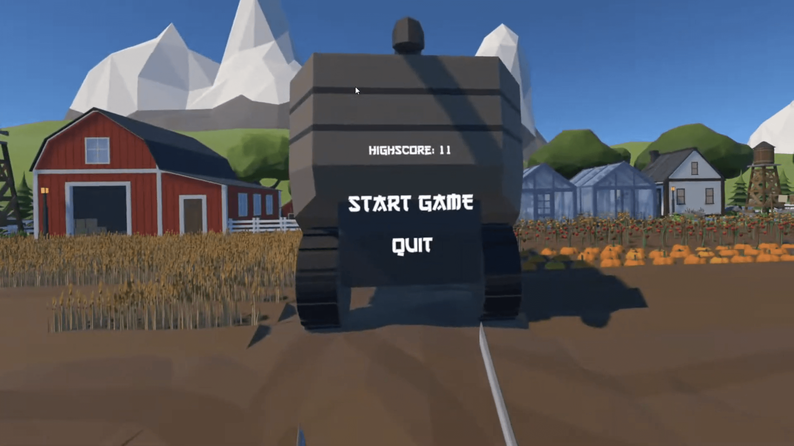

  <h1>🍉 Fruit Ninja VR</h1>
  

  

  📥 <a href="https://github.com/iivvaannxx/fruit-ninja-vr/releases/tag/1.0.0">Download</a>
  &nbsp;·&nbsp;
  🔑 <a href="https://github.com/iivvaannxx/fruit-ninja-vr?tab=License-1-ov-file">License</a>

  

  
<em><b>A simple clone of the popular Fruit Ninja Game, but in VR.</b></em>

  

     
  
  
    
    
  

> [!IMPORTANT]
> This repository is only a showcase of the game. It provides the links to download the game and information about it. The game is not open-source and the source code is not available, primarily due to the use of assets which license does not allow redistribution. The game is built using Unity and is available for Windows.

> [!NOTE]
> I don't own a VR headset anymore, so I couldn't test the game again before publishing this, it should work fine as I still had the final build on my computer. If you find any issues, please let me know.

## 📖 Introduction

This is a game I created for a college subject where we were tasked to create a virtual-reality game using Unity. While thinking about what to create I stumbled upon a tutorial of a [popular VR game developer](https://www.youtube.com/channel/UCPJlesN59MzHPPCp0Lg8sLw) on how to slice objects in VR. After that the idea came up. As a side note, the video was on Patreon (which I was a supporter of), not YouTube, you may not find it in his YouTube channel.

> [!IMPORTANT]
> The game uses the **Oculus** SDK, so you will need an Oculus headset to play it. 

As the player, you will have to slice the fruits that are thrown at you using the controllers. Will you be able to slice them all? 🍉🔪

## 🛠️ Installation

Packaging a game for the Oculus Quest was a bit cumbersome when I developed this, so to facilitate the installation process I decided to only create a Windows build. There is no APK available to install directly on the Oculus Quest. 

You only need to download the game on the [releases page](https://github.com/iivvaannxx/fruit-ninja-vr/releases/tag/1.0.0) and run the executable file. The game will open in VR mode, so make sure you have your Oculus headset connected to your computer. Here is a [step by step guide](https://www.uploadvr.com/how-to-play-pc-vr-oculus-quest-2/) on how to play VR games from your computer on the Oculus Quest (Oculus Link is required).

## 🎮 How to Play

The game mechanics are as simple as they can be. You'll only need to move your controllers to slice the fruits that are throw at you. Let's see how the game works:

### Main Menu

When you open the game, you will be presented with the main menu. From there you only have two options, to start the game or to exit. Your highest score will also be displayed on the screen. Go ahead and press the **"Start Game"** button to start playing.

### Normal Mode

Fruits will start to be thrown at you. First they will come slowly, but as you keep slicing them (more or less every 5 fruits), the time between each fruit will decrease (until a minimum delay of 1 second). If you miss a fruit (it touches the ground without being sliced), the slice will count as a miss. If you miss 10 fruits, the game will be over.

### Rush Mode

To make it a little more fun to play (everyone likes slicing things, right?), I added a Rush Mode. In this mode, a lot (and I mean a lot) of fruits will be thrown at you, approximately during 10 seconds. You will have to slice as many fruits as you can in this time. During this mode, misses **will not count**, so don't worry about missing a fruit. It gets activated completely randomly, you never know when it will happen, neither how many times it will happen during a game.

## 📜 License

The Fruit Ninja VR Clone © 2022 by Ivan Porto Wigner is licensed under CC BY-NC-ND 4.0. To view the details of this license, visit [this link](https://creativecommons.org/licenses/by-nc-nd/4.0/legalcode.en).

## 🎬 Demo

Recorded content when using virtual reality headsets feels very different from the actual experience, because everything moves with the head movement, which can cause motion sickness. Aside from that, when I recorded this, I didn't use movement stabilization (didn't know I could), so the video is a bit shaky. But it gives a good idea of how the game works. I am very bad at the game, so don't judge me. 😅

You can watch a demo gameplay on this link: [https://youtu.be/RZieBhuECZY](https://youtu.be/RZieBhuECZY)
